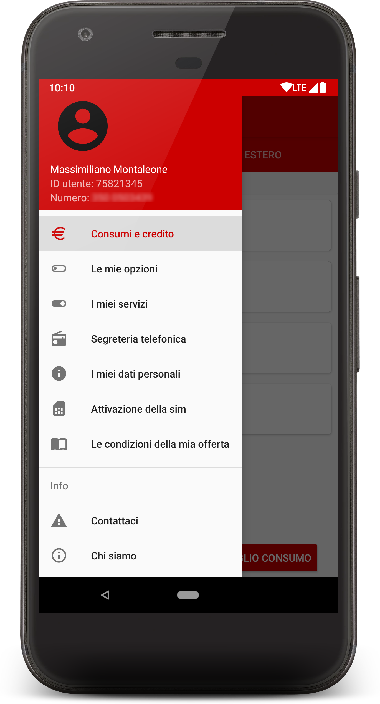
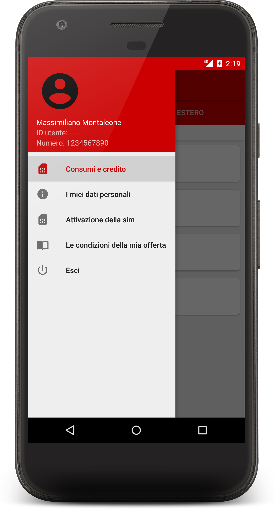
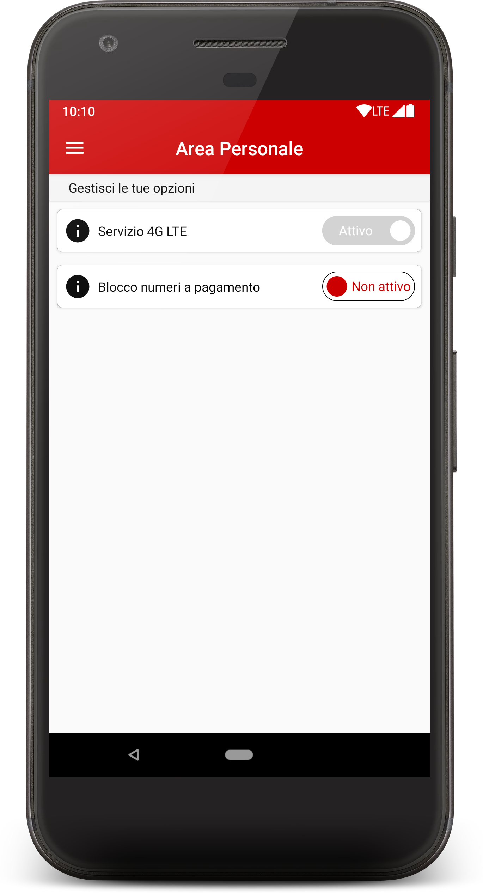

# iliad
<a href="https://paypal.me/fast0n" title="Donate"></a>


Un client/applicazione Web non ufficiale di iliad

Caratteristiche:

Login, attivazione sim, cambio password, cambio email, visualizzazione offerte

## Screenshots
<a></a>
<a></a>
<a></a>

This is an unofficial api developed to learn. Iliad S.A. is not responsible in any way.

This program comes with ABSOLUTELY NO WARRANTY. This is free software, and you are welcome to redistribute it.

```
iliad web app/client
    Copyright (C) 2018  Massimiliano Montaleone

    This program is free software; you can redistribute it and/or modify
    it under the terms of the GNU General Public License as published by
    the Free Software Foundation; either version 2 of the License, or
    (at your option) any later version.

    This program is distributed in the hope that it will be useful,
    but WITHOUT ANY WARRANTY; without even the implied warranty of
    MERCHANTABILITY or FITNESS FOR A PARTICULAR PURPOSE.  See the
    GNU General Public License for more details.

    You should have received a copy of the GNU General Public License along
    with this program; if not, write to the Free Software Foundation, Inc.,
    51 Franklin Street, Fifth Floor, Boston, MA 02110-1301 USA.
```